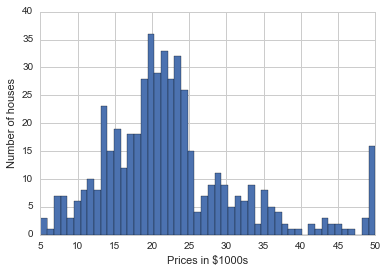
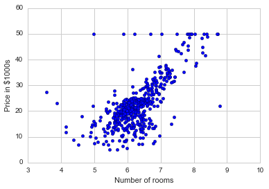
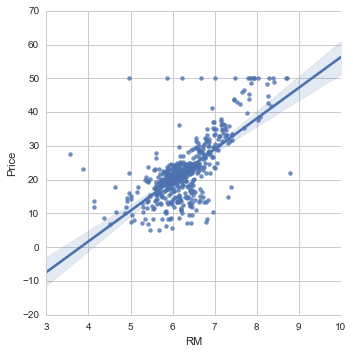
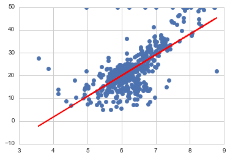
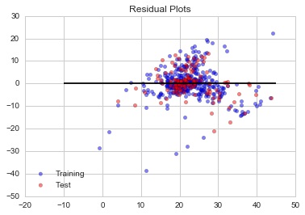

## Supervised Learning: Linear Regression

We will use the sci-kit learn regression model to train the regressor using the fit() method, and then predict new labels using the prdict() method.

Analysis will be done on a dataset consisting of Boston housing prices. We begin by using numpy for a single variable linear regression and then move on to scikit-learn

### Getting and setting up the data


```python
import numpy as np
import pandas as pd
from pandas import Series, DataFrame
import matplotlib.pyplot as plt
```


```python
import seaborn as sns
sns.set_style('whitegrid')
%matplotlib inline
```


```python
from sklearn.datasets import load_boston
```


```python
boston = load_boston()
```


```python
print(boston.DESCR)
```

    Boston House Prices dataset
    
    Notes
    ------
    Data Set Characteristics:  
    
        :Number of Instances: 506 
    
        :Number of Attributes: 13 numeric/categorical predictive
        
        :Median Value (attribute 14) is usually the target
    
        :Attribute Information (in order):
            - CRIM     per capita crime rate by town
            - ZN       proportion of residential land zoned for lots over 25,000 sq.ft.
            - INDUS    proportion of non-retail business acres per town
            - CHAS     Charles River dummy variable (= 1 if tract bounds river; 0 otherwise)
            - NOX      nitric oxides concentration (parts per 10 million)
            - RM       average number of rooms per dwelling
            - AGE      proportion of owner-occupied units built prior to 1940
            - DIS      weighted distances to five Boston employment centres
            - RAD      index of accessibility to radial highways
            - TAX      full-value property-tax rate per $10,000
            - PTRATIO  pupil-teacher ratio by town
            - B        1000(Bk - 0.63)^2 where Bk is the proportion of blacks by town
            - LSTAT    % lower status of the population
            - MEDV     Median value of owner-occupied homes in $1000's
    
        :Missing Attribute Values: None
    
        :Creator: Harrison, D. and Rubinfeld, D.L.
    
    This is a copy of UCI ML housing dataset.
    http://archive.ics.uci.edu/ml/datasets/Housing
    
    
    This dataset was taken from the StatLib library which is maintained at Carnegie Mellon University.
    
    The Boston house-price data of Harrison, D. and Rubinfeld, D.L. 'Hedonic
    prices and the demand for clean air', J. Environ. Economics & Management,
    vol.5, 81-102, 1978.   Used in Belsley, Kuh & Welsch, 'Regression diagnostics
    ...', Wiley, 1980.   N.B. Various transformations are used in the table on
    pages 244-261 of the latter.
    
    The Boston house-price data has been used in many machine learning papers that address regression
    problems.   
         
    **References**
    
       - Belsley, Kuh & Welsch, 'Regression diagnostics: Identifying Influential Data and Sources of Collinearity', Wiley, 1980. 244-261.
       - Quinlan,R. (1993). Combining Instance-Based and Model-Based Learning. In Proceedings on the Tenth International Conference of Machine Learning, 236-243, University of Massachusetts, Amherst. Morgan Kaufmann.
       - many more! (see http://archive.ics.uci.edu/ml/datasets/Housing)
    
    

### Visualizing the data


```python
#Quick visualization of the data
plt.hist(boston.target, bins=50)
plt.xlabel('Prices in $1000s')
plt.ylabel('Number of houses')
```


    <matplotlib.text.Text at 0xf2785eab00>





```python
#Let's see a scatter plot of one of the features
plt.scatter(boston.data[:,5],boston.target)
plt.ylabel('Price in $1000s')
plt.xlabel('Number of rooms')
```


    <matplotlib.text.Text at 0xf2789c7a90>





```python
#Let's use Pandas to transforn the data to a DataFrame
boston_df = DataFrame(boston.data, columns=boston.feature_names)
boston_df.head()
```


<div>
<table border="1" class="dataframe">
  <thead>
    <tr style="text-align: right;">
      <th></th>
      <th>CRIM</th>
      <th>ZN</th>
      <th>INDUS</th>
      <th>CHAS</th>
      <th>NOX</th>
      <th>RM</th>
      <th>AGE</th>
      <th>DIS</th>
      <th>RAD</th>
      <th>TAX</th>
      <th>PTRATIO</th>
      <th>B</th>
      <th>LSTAT</th>
    </tr>
  </thead>
  <tbody>
    <tr>
      <th>0</th>
      <td>0.00632</td>
      <td>18.0</td>
      <td>2.31</td>
      <td>0.0</td>
      <td>0.538</td>
      <td>6.575</td>
      <td>65.2</td>
      <td>4.0900</td>
      <td>1.0</td>
      <td>296.0</td>
      <td>15.3</td>
      <td>396.90</td>
      <td>4.98</td>
    </tr>
    <tr>
      <th>1</th>
      <td>0.02731</td>
      <td>0.0</td>
      <td>7.07</td>
      <td>0.0</td>
      <td>0.469</td>
      <td>6.421</td>
      <td>78.9</td>
      <td>4.9671</td>
      <td>2.0</td>
      <td>242.0</td>
      <td>17.8</td>
      <td>396.90</td>
      <td>9.14</td>
    </tr>
    <tr>
      <th>2</th>
      <td>0.02729</td>
      <td>0.0</td>
      <td>7.07</td>
      <td>0.0</td>
      <td>0.469</td>
      <td>7.185</td>
      <td>61.1</td>
      <td>4.9671</td>
      <td>2.0</td>
      <td>242.0</td>
      <td>17.8</td>
      <td>392.83</td>
      <td>4.03</td>
    </tr>
    <tr>
      <th>3</th>
      <td>0.03237</td>
      <td>0.0</td>
      <td>2.18</td>
      <td>0.0</td>
      <td>0.458</td>
      <td>6.998</td>
      <td>45.8</td>
      <td>6.0622</td>
      <td>3.0</td>
      <td>222.0</td>
      <td>18.7</td>
      <td>394.63</td>
      <td>2.94</td>
    </tr>
    <tr>
      <th>4</th>
      <td>0.06905</td>
      <td>0.0</td>
      <td>2.18</td>
      <td>0.0</td>
      <td>0.458</td>
      <td>7.147</td>
      <td>54.2</td>
      <td>6.0622</td>
      <td>3.0</td>
      <td>222.0</td>
      <td>18.7</td>
      <td>396.90</td>
      <td>5.33</td>
    </tr>
  </tbody>
</table>
</div>


```python
boston_df['Price'] = boston.target
```


```python
boston_df.head()
```


<div>
<table border="1" class="dataframe">
  <thead>
    <tr style="text-align: right;">
      <th></th>
      <th>CRIM</th>
      <th>ZN</th>
      <th>INDUS</th>
      <th>CHAS</th>
      <th>NOX</th>
      <th>RM</th>
      <th>AGE</th>
      <th>DIS</th>
      <th>RAD</th>
      <th>TAX</th>
      <th>PTRATIO</th>
      <th>B</th>
      <th>LSTAT</th>
      <th>Price</th>
    </tr>
  </thead>
  <tbody>
    <tr>
      <th>0</th>
      <td>0.00632</td>
      <td>18.0</td>
      <td>2.31</td>
      <td>0.0</td>
      <td>0.538</td>
      <td>6.575</td>
      <td>65.2</td>
      <td>4.0900</td>
      <td>1.0</td>
      <td>296.0</td>
      <td>15.3</td>
      <td>396.90</td>
      <td>4.98</td>
      <td>24.0</td>
    </tr>
    <tr>
      <th>1</th>
      <td>0.02731</td>
      <td>0.0</td>
      <td>7.07</td>
      <td>0.0</td>
      <td>0.469</td>
      <td>6.421</td>
      <td>78.9</td>
      <td>4.9671</td>
      <td>2.0</td>
      <td>242.0</td>
      <td>17.8</td>
      <td>396.90</td>
      <td>9.14</td>
      <td>21.6</td>
    </tr>
    <tr>
      <th>2</th>
      <td>0.02729</td>
      <td>0.0</td>
      <td>7.07</td>
      <td>0.0</td>
      <td>0.469</td>
      <td>7.185</td>
      <td>61.1</td>
      <td>4.9671</td>
      <td>2.0</td>
      <td>242.0</td>
      <td>17.8</td>
      <td>392.83</td>
      <td>4.03</td>
      <td>34.7</td>
    </tr>
    <tr>
      <th>3</th>
      <td>0.03237</td>
      <td>0.0</td>
      <td>2.18</td>
      <td>0.0</td>
      <td>0.458</td>
      <td>6.998</td>
      <td>45.8</td>
      <td>6.0622</td>
      <td>3.0</td>
      <td>222.0</td>
      <td>18.7</td>
      <td>394.63</td>
      <td>2.94</td>
      <td>33.4</td>
    </tr>
    <tr>
      <th>4</th>
      <td>0.06905</td>
      <td>0.0</td>
      <td>2.18</td>
      <td>0.0</td>
      <td>0.458</td>
      <td>7.147</td>
      <td>54.2</td>
      <td>6.0622</td>
      <td>3.0</td>
      <td>222.0</td>
      <td>18.7</td>
      <td>396.90</td>
      <td>5.33</td>
      <td>36.2</td>
    </tr>
  </tbody>
</table>
</div>


```python
#Plot a linear regression over the scatter plot
sns.lmplot('RM', 'Price', data=boston_df)
```


    <seaborn.axisgrid.FacetGrid at 0xf278f34748>





### Using Numpy for a Univariate Linear Regression


```python
X = boston_df.RM
X.shape
# X
```


    (506,)


```python
#[X 1]
X = np.vstack([X, np.ones(len(X))]).T
#or run the commented code below
# X = np.array([[value,1] for value in X])
X
```


    array([[ 6.575,  1.   ],
           [ 6.421,  1.   ],
           [ 7.185,  1.   ],
           ..., 
           [ 6.976,  1.   ],
           [ 6.794,  1.   ],
           [ 6.03 ,  1.   ]])


```python
X.shape
```


    (506, 2)


```python
Y = boston_df.Price
Y.shape
```


    (506,)


```python
m,b = np.linalg.lstsq(X,Y)[0]
```


```python
plt.plot(boston_df.RM,boston_df.Price,'o')

x = boston_df.RM

plt.plot(x, m*x+b,'r', label='Best Fit Line')
```


    [<matplotlib.lines.Line2D at 0xf279db21d0>]





Same plot as what we got using seaborn linear regression plot
"sns.lmplot('RM', 'Price', data=boston_df)"

### Getting the Error in the Fitted Line


```python
result = np.linalg.lstsq(X,Y)

error_total = result[1]

rmse = np.sqrt(error_total/len(X))

print('The RMSE was {0:.2f}'.format(rmse[0]))
```

    The RMSE was 6.60
    


```python
rmse
```


    array([ 6.60307139])


### Using Scikit learn to implement a multivariate regression


```python
import sklearn
from sklearn.linear_model import LinearRegression
```


```python
lreg = LinearRegression()
```


```python
X_multi = boston_df.drop('Price',1)

Y_target = boston_df.Price
```


```python
lreg.fit(X_multi,Y_target)
```


    LinearRegression(copy_X=True, fit_intercept=True, n_jobs=1, normalize=False)


```python
print('The estimated intercept coefficient is {0:.2f} '.format(lreg.intercept_))

print('The number of coefficients used was {}'.format(len(lreg.coef_)))
```

    The estimated intercept coefficient is 36.49 
    The number of coefficients used was 13
    


```python
coeff_df = DataFrame(boston_df.columns)
coeff_df.columns = ['Features']

coeff_df['Coefficient Estimate']= Series(lreg.coef_)
coeff_df
```


<div>
<table border="1" class="dataframe">
  <thead>
    <tr style="text-align: right;">
      <th></th>
      <th>Features</th>
      <th>Coefficient Estimate</th>
    </tr>
  </thead>
  <tbody>
    <tr>
      <th>0</th>
      <td>CRIM</td>
      <td>-0.107171</td>
    </tr>
    <tr>
      <th>1</th>
      <td>ZN</td>
      <td>0.046395</td>
    </tr>
    <tr>
      <th>2</th>
      <td>INDUS</td>
      <td>0.020860</td>
    </tr>
    <tr>
      <th>3</th>
      <td>CHAS</td>
      <td>2.688561</td>
    </tr>
    <tr>
      <th>4</th>
      <td>NOX</td>
      <td>-17.795759</td>
    </tr>
    <tr>
      <th>5</th>
      <td>RM</td>
      <td>3.804752</td>
    </tr>
    <tr>
      <th>6</th>
      <td>AGE</td>
      <td>0.000751</td>
    </tr>
    <tr>
      <th>7</th>
      <td>DIS</td>
      <td>-1.475759</td>
    </tr>
    <tr>
      <th>8</th>
      <td>RAD</td>
      <td>0.305655</td>
    </tr>
    <tr>
      <th>9</th>
      <td>TAX</td>
      <td>-0.012329</td>
    </tr>
    <tr>
      <th>10</th>
      <td>PTRATIO</td>
      <td>-0.953464</td>
    </tr>
    <tr>
      <th>11</th>
      <td>B</td>
      <td>0.009393</td>
    </tr>
    <tr>
      <th>12</th>
      <td>LSTAT</td>
      <td>-0.525467</td>
    </tr>
    <tr>
      <th>13</th>
      <td>Price</td>
      <td>NaN</td>
    </tr>
  </tbody>
</table>
</div>


The highest correlated feature is RM (the number of rooms)

### Using Training and Validation


```python
X_train,X_test,Y_train,Y_test = sklearn.cross_validation.train_test_split(X,boston_df.Price)
```


```python
print(X_train.shape, X_test.shape,Y_train.shape, Y_test.shape)
```

    (379, 2) (127, 2) (379,) (127,)
    

### Predicting Prices


```python
lreg = LinearRegression()

lreg.fit(X_train,Y_train)
```


    LinearRegression(copy_X=True, fit_intercept=True, n_jobs=1, normalize=False)


```python
pred_train = lreg.predict(X_train)
pred_test = lreg.predict(X_test)
```


```python
# Calculate the mean squares error MSE
print('Fit a model X_train, and calculate the MSE with Y_train: {0:.2f}'.format(np.mean((Y_train-pred_train)**2)))

print('Fit a model X_train, and calculate the MSE with X_test and Y_test: {0:.2f}'.format(np.mean((Y_test-pred_test)**2)))
```

    Fit a model X_train, and calculate the MSE with Y_train: 46.52
    Fit a model X_train, and calculate the MSE with X_test and Y_test: 35.33
    

### Using Residual plots to visualize the difference between the observed values and the predicted values


```python
#Residual = Observed values - Predicted Value

#Scatter plot of the training data
train = plt.scatter(pred_train,(pred_train-Y_train), c='b', alpha=0.5)

#Scatter plot of the test data
test = plt.scatter(pred_test,(pred_test-Y_test), c = 'r', alpha=0.5)

#Plot a horizontal axis at y=0
plt.hlines(y=0, xmin=-10, xmax=45)

#labels
plt.legend((train,test),('Training','Test'), loc = 'lower left')

plt.title('Residual Plots')
```


    <matplotlib.text.Text at 0xf279fde7b8>





It appears that majority of the residuals are randomly allocated above and below the horizontal axis. This is good!


```python

```
